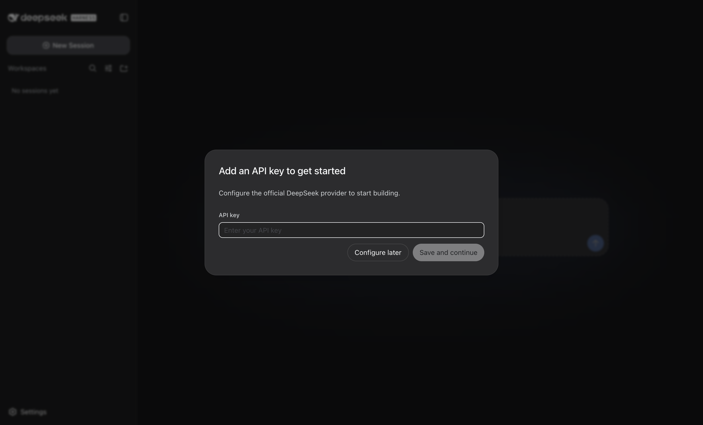
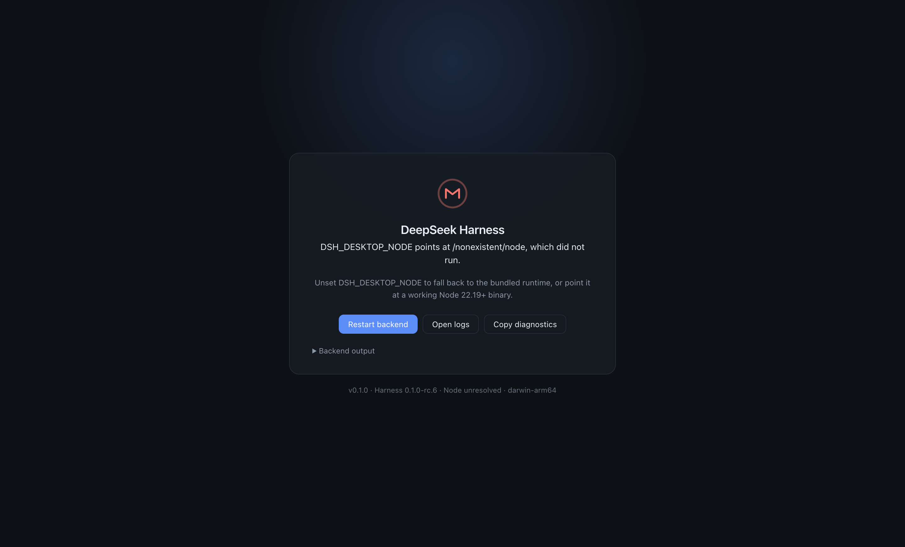

# DeepSeek Harness Desktop

[English](README.md) | 中文

[DeepSeek Harness](https://github.com/deepseek-ai/deepseek-harness)（`dsh`）的桌面版。
Harness 是 DeepSeek 于 2026-08-13 开源的 Agent 运行时，官方提供的是一个启动本地 Web UI
的命令行工具；本仓库把它包装成一个从 Dock 直接双击启动、无需任何前置依赖的桌面应用。

> **非官方项目。** 与 DeepSeek 无隶属关系，未获其背书或支持，详见 [NOTICE.md](NOTICE.md)。



## 相比命令行多了什么

官方的 `npx @deepseek-ai/dsh web` 需要 Node.js 22.19+、一个常开的终端窗口和一个浏览器标签页。
这个应用把这三样都去掉了：

- **零前置依赖。** 安装包内置了固定版本的 Node 运行时和固定版本的 Harness，用户不需要装 Node。
- **真正的应用窗口。** 原生菜单与快捷键、记忆窗口位置与缩放、多窗口共用一个后端，也不用再和
  浏览器争抢键盘快捷键。
- **受管的后端进程。** `dsh web` 随应用启动，异常退出后自动重启，退出应用时连它自己派生的
  子进程（shell、language server）一并清理，不留孤儿进程。
- **Agent 能拿到真正的 `PATH`。** GUI 进程继承的是启动器环境而非登录 shell 环境，所以从桌面
  启动的 Agent 通常会丢掉 `git`、`rg` 以及所有通过 Homebrew / nvm / asdf 安装的工具链。本应用
  会读取一次登录 shell 的 `PATH` 并缓存，让 Agent 的工具集和你的终端一致。
- **看得懂的失败提示。** 后端起不来时，窗口里会直接给出原因、后端自身的输出、重启按钮和一键
  复制诊断信息，而不是一片空白。



## 安装

从 [Releases](https://github.com/xccElephant/deepseek-harness-desktop/releases) 下载：

| 平台 | 文件 |
| --- | --- |
| macOS（Apple Silicon） | `…-arm64.dmg` |
| macOS（Intel） | `…-x64.dmg` |
| Windows x64 | `…-setup.exe` |
| Linux x64 | `…-x86_64.AppImage` 或 `…-amd64.deb` |

构建产物**未使用开发者证书签名**，首次启动系统会拦截：

- **macOS** —— 应用做了 ad-hoc 签名但未经过公证，需要先清除下载隔离属性才能打开。
  请先把它拖到「应用程序」，然后在「系统设置 → 隐私与安全性」中选择「仍要打开」，或执行：

  ```sh
  xattr -dr com.apple.quarantine "/Applications/DeepSeek Harness Desktop.app"
  ```

  请在第一次尝试打开之前就执行；macOS 会缓存拦截结果，事后再清除属性可能需要重新拷贝一份应用。

- **Windows** —— SmartScreen 提示「Windows 已保护你的电脑」，选择「更多信息」→「仍要运行」。

应用不附带任何 API 凭据。首次运行时 Harness 会像命令行版一样引导你填入模型提供商的 Key。

## 工作原理

```text
Electron 主进程
 ├─ 派生: <内置 node> <内置 dsh>/lib/bin.js web --port 0
 │            └─ 监听成功后打印 "dsh web: http://127.0.0.1:<port>"
 └─ BrowserWindow 加载该 URL
```

有三个设计决策值得说明，它们是这套方案稳定而非取巧的原因：

**后端是独立进程，而不是加载进 Electron 的代码。** Harness 依赖针对标准 Node ABI 编译的原生
模块（`node-pty`、`sharp`）。用普通 Node 二进制运行它们，无需为 Electron ABI 重新编译，
后端崩溃也不会把窗口一起带走。

**窗口加载 `http://127.0.0.1`，而不是 `file://` 加 IPC 桥。** Harness 把特权能力——设置、
凭据、原生目录选择器、用系统应用打开路径——都限制在「回环地址 + 同源」的信任边界内。直接使用
真实来源即可满足该边界，桌面版行为与浏览器会话完全一致，也不需要维护任何桥接层。

**端口用 `0`。** 由操作系统分配端口，后端把它打印出来，外壳从那一行读取。既不需要探测空闲端口，
也不会和你已经在终端里跑着的 `dsh` 撞端口。

缓存就绪后，从启动到界面渲染约 1.5 秒。

## 文件位置

| 内容 | 路径 |
| --- | --- |
| 外壳日志 | `<userData>/logs/desktop.log`（菜单 File → Open Log Folder） |
| 外壳设置 | `<userData>/settings.json` |
| Harness 数据、配置、会话 | `~/.dsh`（菜单 File → Open Harness Home） |

`<userData>` 在 macOS 为 `~/Library/Application Support/DeepSeek Harness Desktop`，
Windows 为 `%APPDATA%\DeepSeek Harness Desktop`，Linux 为
`~/.config/DeepSeek Harness Desktop`。

Agent 本身的一切——模型提供商、权限、Skill、MCP 服务——都在 Harness 界面里配置并存放于
`~/.dsh`，与本仓库无关。外壳只管窗口状态和两个后端参数：

```json
{
  "port": 0,
  "extraArgs": []
}
```

`port` 用于固定后端端口（不再由系统分配），`extraArgs` 会原样追加到 `dsh web` 后面。

## 从源码构建

需要 Node.js 24（版本固定在 `package.json` 的 `dshDesktop.nodeVersion`）以及 C++ 工具链——
安装 Harness 载荷时会编译 `node-pty`。

```sh
git clone https://github.com/xccElephant/deepseek-harness-desktop.git
cd deepseek-harness-desktop
npm ci
npm run prepare:payload   # 下载 Node 运行时并安装 Harness（约 2 分钟）
npm run dev               # 构建并启动
npm run dist              # 为当前平台构建安装包，输出到 release/
```

`prepare:payload` 会用 `SHASUMS256.txt` 校验下载的 Node，并跳过已是最新的步骤；给任一
prepare 脚本传 `--force` 可强制重做。

安装包必须在对应平台的 runner 上原生构建，不能交叉编译：内置的 Node 二进制和 Harness 的原生
模块都是分平台分架构的。[发布工作流](.github/workflows/release.yml)覆盖 macOS arm64、
macOS x64、Windows x64 与 Linux x64。

## 升级内置的 Harness

上游处于 Developer Preview 阶段并明确会有破坏兼容性的变更，所以版本是固定的而非浮动的：

```jsonc
// package.json
"dshDesktop": {
  "dshVersion": "0.1.0-rc.6",
  "nodeVersion": "24.19.0"
}
```

改掉 `dshVersion`，执行 `npm run prepare:dsh`，确认应用仍能正常进入界面即可。本仓库不依赖上游
任何内部实现——唯一的耦合是命令行调用方式（`dsh web --port`）以及服务监听后打印的那一行。

这件事不用盯着：[upstream-watch](.github/workflows/upstream-watch.yml) 每天比对 npm 上的
`latest`，发现新版就提一个只改这一个字段的 PR，并对该分支启动一次完整构建——四个平台打包，然后
真装真启 Linux 与 Windows 版本。合并与发布仍是手动的：上游还是开发者预览版，随时可能改掉上面那
两处耦合，而这种回归应该由人看一眼再决定。

## 更新

应用启动后会查一次[最新发布](https://github.com/xccElephant/deepseek-harness-desktop/releases/latest)，
有新版才提示，可以选择"这个版本不再提醒"。菜单 Help → Check for Updates… 可随时手动检查。

查询先问 releases API，问不到再退回 `/releases/latest` 的重定向——两者单独都不够用：API 权威，
但匿名配额是每个 IP 每小时 60 次，共享出口后面很容易已经用光；重定向没有配额，但它走缓存，实测在
刚发布后的几分钟里会落后于真实的最新版。两条都失败就静默跳过，不会影响启动。

没有自动下载安装：在没有开发者证书的前提下，让应用自己替换自己的二进制，等于把未经校验的下载内容
直接执行。所以它只负责告诉你，装不装由你点。

## 已知限制

- **没有开发者证书签名与公证**（macOS 仅做 ad-hoc 签名），因此有上面提到的首次启动拦截。
- **不会自动安装更新**，只会提示；见上文「更新」。
- **上游仍是开发者预览版。** 破坏性变更频繁。自动检查会真装真启 Linux 与 Windows 版本，
  macOS 版本仍需发布前手动启动确认。
- **每台机器一个后端。** 重复启动会聚焦已有窗口，而不是对同一个 `~/.dsh` 再起一个后端。

## 许可

本仓库自身代码为 [MIT](LICENSE)。内置载荷各自遵循其原有许可，详见 [NOTICE.md](NOTICE.md)。
